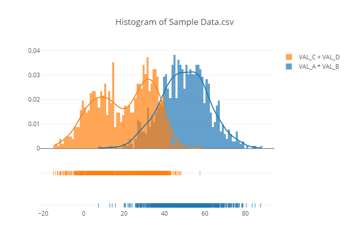

# Simple programming assessment

## Instructions
This repo contains a ``.CSV`` file with a sample data set. Please generate two separate distribution graphs.
* The first one plotting the distribution of ``VAL_A`` * ``VAL_B``
* The second one plotting the distribution of ``VAL_C`` + ``VAL_D``

Submit both your graphs and the code used to generate them.

Submit your own comments on both the data and the distribution graphs.

Thanks for your interest in the position!

## Solution
### Comments
#### Dataset
The following statements can be made by the dataset ``Sample Data.csv``
* Delimiter:
  * Data delimiter is ``;``
  * Decimal delimiter is ``,``
* Data findings:
  * Data Sample_ID ``13`` is missing
  * Data Sample_ID ``42`` for columns ``VAL_A`` is wrong, probably missing a delimiter (``0.755`` instead of ``0755``) => row dropped
  * Data Sample_ID ``50`` for columns ``VAL_A`` data is missing => row dropped

#### Distribution Plots
* The first plot combines ``VAL_A * VAL_B``. There a single peak at around 53 with a negative slope. The top of the histogram is flattened between 45 and 55.
* The second plot combines ``VAL_C + VAL_D`` and shows two peaks. One at around 9 and the other at around 32.

